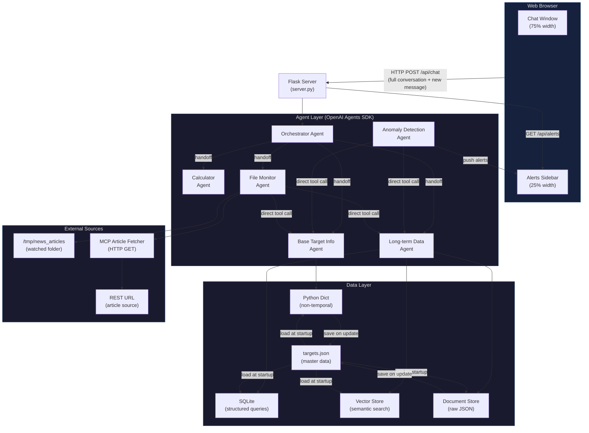
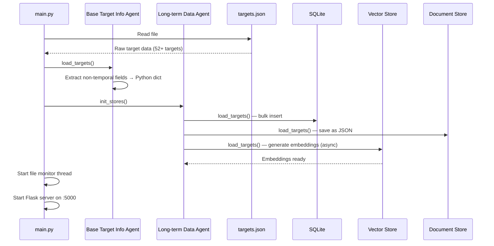
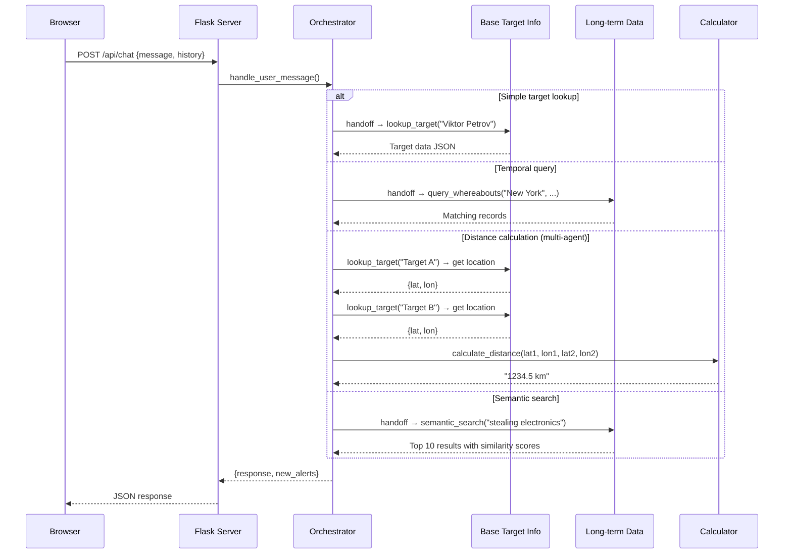
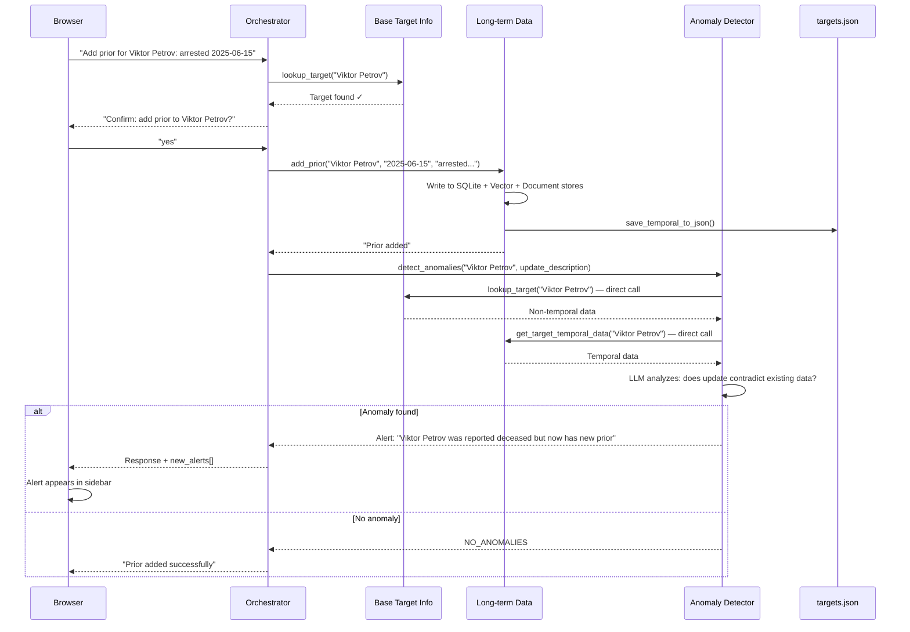
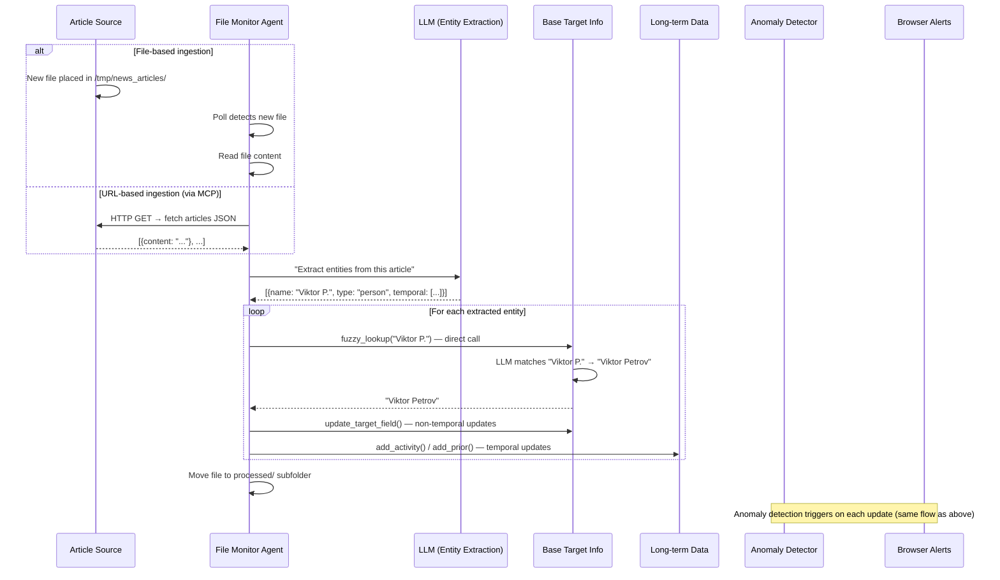
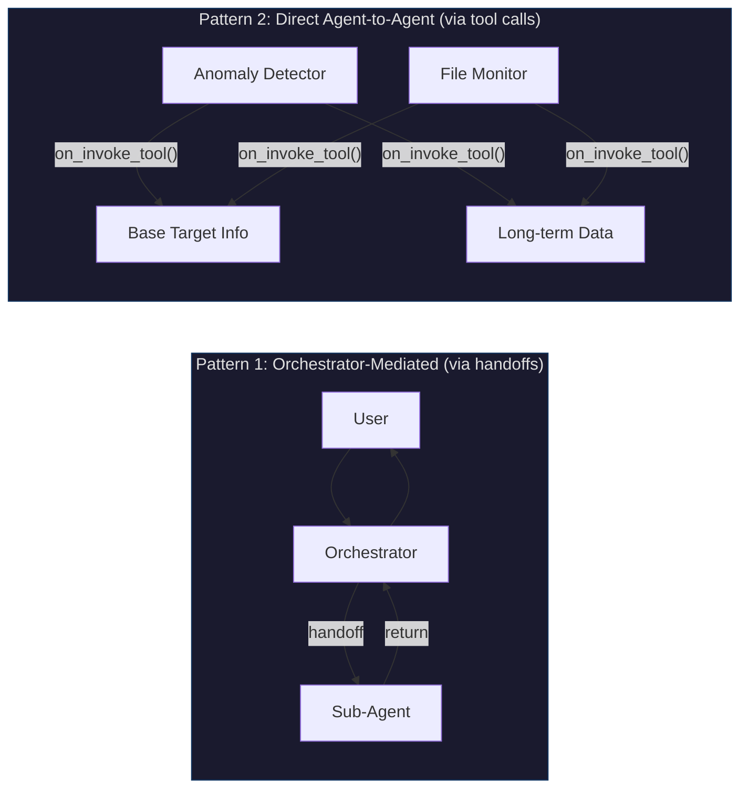

# Target Tracker — Architecture & Design

## System Overview

Target Tracker is a multi-agent application that manages intelligence on 1000 tracked targets (people, buildings, vehicles). A user interacts via a web chat interface, and an orchestrator agent delegates work to specialized agents.



## Agents in Detail

### 1. Orchestrator Agent (`src/agents/orchestrator.py`)

**Role:** Central router. Receives every user message and decides which agent(s) to call.

**Responsibilities:**
- Parse user intent (query, update, calculation, article fetch)
- Call one or more agents to fulfill the request
- For updates: confirm the target match with the user before writing
- Combine results from multiple agents into a coherent response
- For multi-step tasks (e.g., "distance between Target A and Target B"): fetch data from base-target-info, then pass coordinates to calculator

**Communication pattern:** Calls other agents as tools via the OpenAI Agents SDK tool/handoff mechanism.

### 2. Base Target Info Agent (`src/agents/base_target_info.py`)

**Role:** Manages all non-temporal target data in an in-memory Python dict.

**Data it owns (per target):**
- Target name (unique key)
- Target type: `person`, `building`, or `vehicle`
- Current location (latitude, longitude)
- Birthday / manufacture date
- Current associations (references to other target keys)
- Identifying characteristics (list of strings)

**Key behaviors:**
- Loads from `data/targets.json` at startup (non-temporal fields only)
- **Fuzzy name matching via LLM**: when a query doesn't exactly match a key, the agent sends the query + a list of candidate keys to the LLM and asks it to pick the best match
- Updates are written back to `data/targets.json` on every change
- Can list all target keys, or return full detail on a specific target

### 3. Calculator Agent (`src/agents/calculator.py`)

**Role:** Pure math operations. No data storage.

**Functions:**
- `calculate_age(birthdate)` — Returns age in years given a date string
- `calculate_distance(lat1, lon1, lat2, lon2)` — Haversine distance in km between two coordinates

**Usage pattern:** The orchestrator fetches coordinates from base-target-info-agent, then passes them to the calculator. This demonstrates multi-agent data flow.

### 4. Long-term Data Agent (`src/agents/longterm_data.py`)

**Role:** Manages all temporal/event-based target data.

**Data it owns (per target):**
- Suspicious activities (timestamp + description)
- Non-suspicious activities (timestamp + description)
- Known whereabouts (city, start date, end date)
- Priors (date + description of illegal activity)

**Backed by 3 storage types** (defined in `src/db/`):

| Store | Technology | Purpose |
|-------|-----------|---------|
| `sqlite_store.py` | SQLite (stdlib) | Structured queries: date ranges, location filters, counting priors |
| `vector_store.py` | In-memory embeddings | Semantic search: "targets caught stealing electronics" |
| `document_store.py` | JSON file-based | Raw document storage, full-text retrieval |

All three stores are loaded from `data/targets.json` (temporal fields) at startup. The agent decides which store to query based on the request type. Updates go to all three stores and back to the JSON file.

### 5. File Monitor Agent (`src/agents/file_monitor.py`)

**Role:** Watches a folder for new article files, extracts target-relevant information.

**Flow:**
1. Polls a configurable folder (default: `/tmp/news_articles`) for new files
2. Reads each new file and sends contents to the LLM to extract entities (people, buildings, vehicles)
3. Calls base-target-info-agent to check if extracted entities match known targets (direct agent-to-agent call — demonstrates this pattern)
4. If matches found, builds update payloads and routes them through the orchestrator (or directly to the appropriate data agent)
5. Moves processed files to a `processed/` subfolder

**MCP integration:** Can also fetch articles from a REST URL via the MCP server, then processes them the same way.

### 6. Anomaly Detection Agent (`src/agents/anomaly_detector.py`)

**Role:** Triggered on every target update. Looks for contradictions or surprises.

**Flow:**
1. Receives the update that just occurred (target key + new data)
2. Calls base-target-info-agent and long-term-data-agent directly to pull existing target data
3. Sends existing + new data to the LLM asking: "Does this update conflict with or contradict existing information?"
4. If anomaly detected, creates an alert object (timestamp, description, target key)
5. Alert is pushed to the UI via the Flask server's alert endpoint

**Examples of anomalies:**
- Person with a "deceased" prior is spotted alive
- Vehicle reported in two distant cities on the same day
- Building listed as demolished has new activity

## MCP Server (`src/mcp/article_fetcher.py`)

A small, self-contained MCP server that exposes one tool: `fetch_articles(url)`.

- Takes a URL, performs an HTTP GET, expects a JSON response with a list of articles
- Returns the article list to the calling agent
- The file monitor agent uses this as an alternative to reading files from disk
- Designed to connect to a dummy localhost server that serves test articles

## Data Flow Diagrams

### Startup Sequence



### User Query Flow



### Target Update Flow (with Anomaly Detection)



### Article Ingestion Flow



### Agent Communication Patterns

This app demonstrates two agent communication patterns:



**When to use which:**
- **Orchestrator-mediated**: When the user initiates a request and the LLM needs to decide which agent to call. The SDK handles routing via handoffs.
- **Direct agent-to-agent**: When one agent programmatically needs data from another (no LLM decision needed). Calls `tool.on_invoke_tool(None, json.dumps({...}))` directly.

## Configuration

### config.yaml
```yaml
llm:
  provider: "openai"          # "openai" or "ollama"
  model: "gpt-4o"             # Model name (for Ollama, e.g., "llama3")
  base_url: null              # Override for Ollama: "http://localhost:11434/v1"

monitor:
  watch_folder: "/tmp/news_articles"
  poll_interval_seconds: 30

db:
  sqlite_path: "data/target_tracker.db"
  vector_store_path: "data/vector_store.json"
  document_store_path: "data/document_store.json"

server:
  host: "0.0.0.0"
  port: 5000
```

### .env
```
OPENAI_API_KEY=sk-...
```

## Project Structure

```
target_tracker/
├── CLAUDE.md
├── config.yaml
├── .env.example
├── requirements.txt
├── Dockerfile
├── docker-compose.yml
├── data/
│   ├── targets.json              # Master data file (50-100 hand-crafted + generated)
│   └── generate_targets.py       # Script to generate synthetic targets
├── src/
│   ├── __init__.py
│   ├── main.py                   # Entry point: starts Flask + file monitor
│   ├── config.py                 # Loads config.yaml + .env
│   ├── logging_config.py         # Colored per-agent logging
│   ├── server.py                 # Flask routes (chat, alerts)
│   ├── agents/
│   │   ├── __init__.py
│   │   ├── orchestrator.py
│   │   ├── base_target_info.py
│   │   ├── calculator.py
│   │   ├── longterm_data.py
│   │   ├── file_monitor.py
│   │   └── anomaly_detector.py
│   ├── db/
│   │   ├── __init__.py
│   │   ├── sqlite_store.py
│   │   ├── vector_store.py
│   │   └── document_store.py
│   └── mcp/
│       ├── __init__.py
│       └── article_fetcher.py
├── static/
│   ├── index.html
│   ├── style.css
│   └── app.js
├── docs/
│   ├── architecture.md           # This file
│   └── user_manual.md
└── tests/
```

## Technology Choices

| Technology | Why |
|-----------|-----|
| **OpenAI Agents SDK** | Core teaching target — the whole point of this app |
| **Flask** | Minimal, well-known Python web framework. No magic. |
| **SQLite** | Python stdlib, no install needed, teaches real SQL |
| **Vanilla HTML/JS/CSS** | Zero frontend build tools, anyone can read it |
| **PyYAML** | Simple config loading, widely known |
| **python-dotenv** | Standard .env file loading |
| **Docker** | Optional packaging, standard industry tool |

No heavy frameworks, no ORMs, no React/Vue/Angular, no Redis, no Postgres. Everything a developer needs to understand is right in the code.
